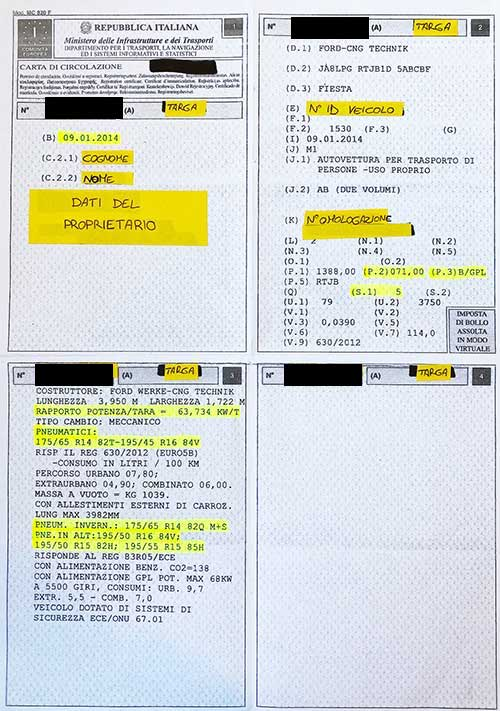

# Carta di circolazione

Documento che contiene tutte le informazioni circa l'autovettura, rilasciata al momento dell'immatricolazione di un'auto insieme alla targa. È composta di 4 quadranti.

- Primo quadrante: dainformazioni sul proprietario del veicolo e sulla data della prima immatricolazione
- Secondo quadrante: da informazioni sul veicolo stesso
- Terzo quadrante:
- Quarto quadrante:

Inoltre sul retro vi è una leggenda delle varie voci contenute, a destra in alto vengono apposti fli adesivi per l'esito positivo della revisione obbligatoria

### Primo quadrante

    (A) numero di immatricolazione, cioè la targa
    (B) data di prima immatricolazione
    (C.2) proprietario del veicolo
    (C.2.1) cognome o ragione sociale
    (C.2.3) indirizzo nello Stato membro di immatricolazione alla data di rilascio del documento
    (C.3) persona fisica o giuridica che può disporre del veicolo a titolo diverso da quello di proprietario
    (C.3.1) cognome o ragione sociale
    (C.3.2) nome/i o iniziale/i (se del caso)
    (C.3.3) indirizzo nello Stato membro di immatricolazione alla data di rilascio del documento

### Secondo quadrante
    
    (D.1) marca veicolo
    (D.2) tipo veicolo
    (D.3) denominazione/i commerciale/i
    (E) numero di telaio
    (F.1) massa massima a carico tecnicamente ammissibile, ad eccezione dei motocicli
    (F.2) massa massima a carico ammissibile del veicolo
    (F.3) massa massima a carico ammissibile dell’insieme (motrice + rimorchio)
    (G) massa del veicolo in servizio carrozzato e munito del dispositivo di attacco per i veicoli trattori di categoria diversa dalla M1
    (I) data di immatricolazione alla quale si riferisce la carta di circolazione
    (J) categoria del veicolo
    (J.1) destinazione ed uso del veicolo
    (J.2) carrozzeria del veicolo
    (K) numero di omologazione del tipo (se disponibile)
    (L) numero di assi
    (N.1) ripartizione tra gli assi della massa massima a carico tecnicamente ammissibile (per i veicoli con massa totale superiore a 3500 kg) asse 1 (kg)
    (N.2) asse 2 (kg), se del caso
    (N.3) asse 3 (kg), se del caso
    (N.4) asse 4 (kg), se del caso
    (N.5) asse 5 (kg), se del caso
    (O.1) massa massima a rimorchio tecnicamente ammissibile con rimorchio frenato (kg)
    (O.2) massa massima a rimorchio tecnicamente ammissibile con rimorchio non frenato (kg)
    (P.1) cilindrata (cm3)
    (P.2) potenza netta massima (kW) (se disponibile)
    (P.3) tipo di combustibile o di alimentazione
    (P.5) numero di identificazione del motore
    (Q) rapporto potenza/massa in kW/kg (solo per i motocicli)
    (S.1) numero di posti a sedere, compreso quello del conducente
    (S.2) numero di posti in piedi (se del caso).
    (U.1) livello sonoro a veicolo fermo [dB(A)]
    (U.2) livello sonoro a regime del motore (giri*min-1)
    (V.1) CO (g/km o g/kWh)
    (V.2) HC (g/km o g/kWh)
    (V.3) NOx (g/km o g/kWh)
    (V.5) particolato per i motori diesel (g/km o g/kWh)
    (V.7) CO2 (g/km)
    (V.9) indicazione della classe ambientale di omologazione CE.

### Terzo quadrante    
    dimensioni
    pneumatici ammessi
    eventuale gancio di traino
    consumi in percorso urbano, extraurbano e combinato
    massa a vuoto
    rapporto potenza/peso
    tipo di cambio

### Quarto quadrante
    Questa parte è solitamente vuota. Serve per eventuali adesivi di aggiornamento del libretto quando cambiano le caratteristiche tecniche del veicolo.